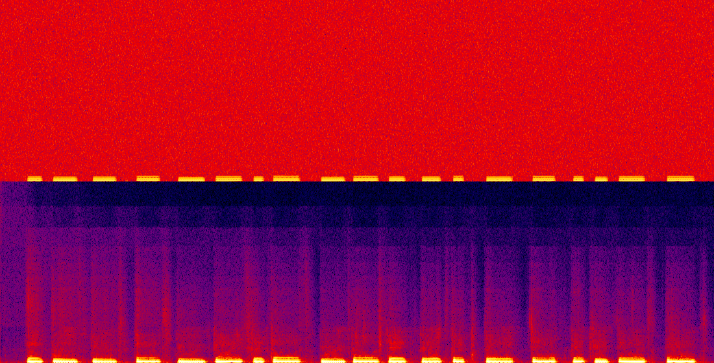
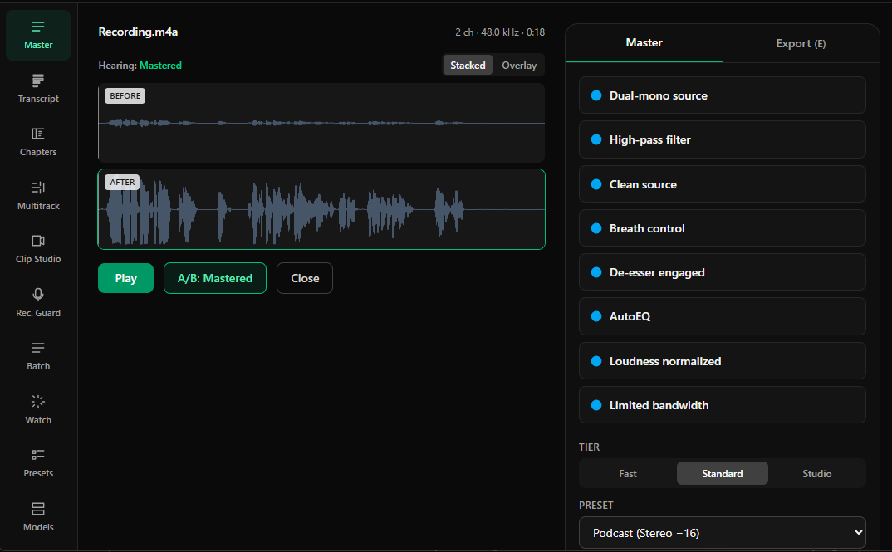

<div align="center">

# Cleanroom

*You recorded in a real room. Cleanroom makes it sound like you didn't.*

### Free, local podcast mastering. Drop a file, press Master, done.

**Cleanroom** takes any podcast recording and makes it sound professionally mastered — loudness, AI denoise, and adaptive leveling — in one click. Drop a file, press **Master**, export at broadcast loudness about a minute later. It runs 100% on your machine. Free, open-source, no account, no cloud, no subscription, no telemetry. None of that.

[](https://github.com/bluejacketblackhawk/cleanroom/actions/workflows/ci.yml)
[](LICENSE)
[](#privacy)
[](#privacy)
[](#requirements)

<br />



<em>Top: the raw recording — broadband noise smeared across every frequency. Bottom: the same clip after one press of <strong>Master</strong>. Same voice, the room and the hiss gone, brought up to broadcast loudness.</em>

<br /><br />

<video src="https://github.com/bluejacketblackhawk/cleanroom/raw/main/assets/demo.mp4" controls width="820"></video>

<em>▶ <strong>Hear it</strong> — eight seconds of the raw recording, then the same clip after Cleanroom. (It's an audio tool; a silent GIF wouldn't tell you a thing.)</em>

<br /><br />



<em>The Master screen. Before and after waveforms with a sample-aligned <strong>A/B</strong> toggle — flip between the original and the mastered take at any point (cloud tools structurally can't) — and the whole chain it ran on the right, module by module, at your chosen tier and preset.</em>

</div>

---

## Download

Grab a file and run it. No command line, no account, no setup — ffmpeg and the models are bundled in.

| | |
|---|---|
| **Windows 10/11** (x64) | [**Download installer (.exe)**](https://github.com/bluejacketblackhawk/cleanroom/releases/latest/download/Cleanroom-windows-x64-setup.exe) · [portable .zip](https://github.com/bluejacketblackhawk/cleanroom/releases/latest/download/Cleanroom-windows-x64-portable.zip) |
| **macOS** (Apple Silicon) | [**Download .dmg**](https://github.com/bluejacketblackhawk/cleanroom/releases/latest/download/Cleanroom-macos-arm64.dmg) |
| **macOS** (Intel) | [**Download .dmg**](https://github.com/bluejacketblackhawk/cleanroom/releases/latest/download/Cleanroom-macos-x64.dmg) |

It's maintained as it goes — if it wrecks your audio, [open an issue](https://github.com/bluejacketblackhawk/cleanroom/issues) and it'll get fixed.

The Windows build is unsigned, so SmartScreen will say "unknown publisher" — **More info → Run anyway**. The Mac DMGs are signed and notarized, so they open with a normal double-click.

[All files, version-pinned builds + SHA-256 checksums →](https://github.com/bluejacketblackhawk/cleanroom/releases/latest)

## One click, and it sounds mastered

Drop an audio or video file, press **Master**, export. That one button runs the whole chain locally: two-pass loudness to a broadcast target (EBU R128, true-peak safe), AI denoise (DeepFilterNet3) that pulls the room, hiss, and fan out from behind your voice, and adaptive leveling so a quiet guest and a loud host land at the same volume. On a noisy demo episode that's −30 LUFS with a −39 dB noise floor, one click brings it to a dead-on −16 LUFS with the floor pushed down past −67 dB, no clipping. Then flip the **A/B** toggle to hear exactly what it did, per module, sample-aligned. Everything else — tiers, batch, transcription, multitrack — is progressive disclosure on top. The default path is three clicks and nothing else.

## Prove it yourself

None of those numbers have to be taken on faith — the binary grades its own work. Wreck a clean clip, master it, and make it measure both sides:

```sh
# wreck any clean voice clip: -13 dB of gain, room echo, pink hiss, 60 Hz hum
ffmpeg -i clean.wav -filter_complex "[0:a]volume=-13dB,aecho=0.7:0.6:28|46:0.22|0.14[v];anoisesrc=color=pink:amplitude=0.012:duration=30[n];sine=frequency=60:duration=30,volume=0.006[h];[v][n][h]amix=inputs=3:duration=first:normalize=0" wrecked.wav

# from a checkout: master it, then measure both
cargo run --release -p anvil-cli -- master wrecked.wav -o fixed.wav
cargo run --release -p anvil-cli -- analyze wrecked.wav
cargo run --release -p anvil-cli -- analyze fixed.wav
```

One run of exactly that recipe lives in this repo — [the wrecked clip](assets/wreck-before.wav) and [the same file after one Master](assets/wreck-after.wav). The narration is a local synthetic voice on purpose: no microphone, no human take, so the entire demo reproduces from scratch on your machine.

| | wrecked | after one Master |
|---|---|---|
| integrated loudness | −41.8 LUFS | **−16.1 LUFS** (target −16) |
| true peak | −24.9 dBTP | **−1.00 dBTP** (ceiling −1) |
| SNR | 15.1 dB | **70.3 dB** |

And because renders are deterministic, running it again produces those bytes again. Not similar bytes. Those bytes.

## What it does

- **Master.** Loudness (EBU R128, true-peak safe) + AI denoise (DeepFilterNet3) + adaptive leveling, in one click, on your machine.
- **Instant A/B.** Flip between the original and the mastered take at any playhead, per module, sample-aligned. Free because it's all local.
- **A Health Card in plain English.** "Room echo: noticeable. Hum at 60 Hz: yes. Loudness −23.1 → will raise to −16." Words by default, numbers on hover.
- **Export anywhere.** WAV, MP3, FLAC, Opus, AAC/M4B, mono or stereo, several formats at once. Video in? The audio's processed and the video streams through untouched.
- **Back-catalog re-master.** Point it at a folder of old episodes and level + denoise them to one consistent sound overnight, unlimited, free.
- **Watch folders.** Drop a file in, get a mastered copy out, automatically.
- **Transcribe & label speakers.** Local whisper.cpp with word timestamps and diarization; export SRT/VTT.
- **Cut the dead air.** Silence and filler-word removal you review before it applies, never a silent auto-edit.
- **Multitrack.** Per-track chains, crossgate, ducking, and double-ender auto-alignment for remote interviews.
- **Chapters, metadata, clips, reports.** Full tag/chapter editor (incl. M4B), captioned audiogram clips, and per-episode loudness/compliance reports for clients.
- **A real CLI** for scripting and batch automation.
- **Deterministic.** Same input, same settings, same version → bit-identical output, every time. That's what makes the numbers trustworthy.

## Cleanroom vs Auphonic

Straight up: Auphonic is a genuinely excellent service and it's been the gold standard for podcast loudness for years. The whole point here is that it runs entirely on your machine, for free, and you can read every line of it.

| | **Cleanroom** | **Auphonic** |
|---|---|---|
| Price | Free, open-source (MIT) | 2 h/mo free, then $11–89/mo |
| Where your audio goes | Stays on your machine | Uploaded to their servers |
| Hours / file size | Unlimited | Credit-metered |
| Works offline | Yes, verifiably (pull your cable) | No, needs the cloud |
| Speed | Realtime-plus, no upload | Upload → queue → download |
| Back-catalog re-master | Unlimited, local, overnight | Costs credits per file |
| Platforms | Windows 10/11 and macOS (Apple Silicon and Intel) | Web |
| Transcription + diarization | Yes, local (whisper.cpp) | Yes, cloud |

Adobe Podcast / Enhance Speech ($9.99/mo, daily and file-size caps) is the other tool people pay for to do exactly this. Cleanroom does the same job — loudness, denoise, leveling, transcription — with nothing uploaded, nothing metered, and nothing to cancel.

## Re-master your whole back catalog

The thing cloud tools make painful, because they meter you: point Cleanroom at a folder of every episode you've ever made and it re-masters all of them to one consistent loudness and noise profile, unattended, overnight, for free.

- **Batch queue.** Drop in files or a whole folder, pick a preset, walk away. It scales across your cores and stays responsive the whole time.
- **Presets per show.** Save a show's exact chain + target once, apply it to everything.
- **A compliance report per episode.** Before/after LUFS, true peak, and LRA as HTML or PDF — freelancers attach it to invoices.
- **Watch folders.** Or skip the batch entirely: drop new recordings into a watched folder and mastered copies appear beside them.

## Requirements

**Windows**
- Windows 10/11 (x64)
- ~500 MB free disk (more if you add the optional transcription / Studio model packs)
- No GPU required — the CPU path is first-class. A GPU only speeds up the heavier Studio tier.

**macOS**
- macOS 12+ on Apple Silicon or Intel
- ~500 MB free disk; the DMGs are signed and notarized, so it's a plain double-click.

## Build from source

You don't need any of this to *use* Cleanroom — [download it](#download), run it, done. This is for hacking on it.

Prereqs: [Rust](https://rustup.rs) (stable), [Node.js](https://nodejs.org) 20+, and the platform C toolchain (MSVC C++ Build Tools on Windows, Xcode Command Line Tools on Mac).

```sh
cd apps/desktop
npm install         # frontend deps + the Tauri CLI
npm run tauri dev   # launches the app
```

- `npm run tauri dev` runs the app.
- `cargo run -p anvil-cli -- --help` is the headless CLI (`analyze` / `master` / `transcribe` / `batch`).
- `npm run lint` and `npm run typecheck` check the frontend; `cargo test --workspace --exclude anvil-desktop` runs the engine tests.

## Building a release

The installer bundles ffmpeg, whisper.cpp, and sherpa-onnx right into the package, so whoever runs it gets zero setup and no download. Fetch the sidecars into `vendor/` first, then package.

Windows:

```powershell
scripts/fetch-ffmpeg.ps1; scripts/fetch-whisper.ps1; scripts/fetch-sherpa.ps1
cd apps/desktop
npm run package:win   # -> target/release/bundle/nsis/Cleanroom_<version>_x64-setup.exe (+ a portable zip)
```

Mac (makes a `.dmg` for both Apple Silicon and Intel):

```bash
# build the darwin sidecars first: scripts/build-ffmpeg-macos.sh, build-whisper-macos.sh, fetch-sherpa-macos.sh
cd apps/desktop
npm run package:mac:arm64 && npm run package:mac:x64
```

Windows builds are unsigned, so first launch you'll get a SmartScreen "unknown publisher" nag (More info → Run anyway) until it's code-signed. The Mac DMGs are signed and notarized, so Gatekeeper accepts them as a normal double-click.

## How it's built

A [Tauri 2](https://tauri.app) shell — a ~10 MB native window on the OS webview, no Chromium shipped — over a Rust core that does all the audio, AI, and IO, with a React + TypeScript UI that's just a remote control for the engine.

- **The engine is Rust,** streaming and chunked, so a 3-hour episode masters in well under 1.5 GB of RAM. Playback runs in Rust (via `cpal`), never through the webview — that's what makes A/B sample-accurate.
- **On-device models.** DeepFilterNet3 (denoise), Silero VAD, whisper.cpp (transcription), sherpa-onnx (diarization) — all bundled, all local.
- **ffmpeg** runs as a separate LGPL sidecar process (never linked), only for decode/encode.

Architecture and the reasoning behind every choice live in [`docs/adr/`](docs/adr/) and [`handoff/`](handoff/). Those are the source of truth.

## Privacy

Privacy here isn't a setting, it's how the thing is built.

- **Your audio never leaves the machine.** There are no cloud calls in the processing path, period. Pull your network cable and every feature still works.
- **No telemetry, no analytics, no crash upload.** Crash dumps stay local with a "copy for a GitHub issue" button — you choose what to share.
- **The only time it touches the internet** is an optional update check and optional, user-initiated model-pack downloads. Both fail safe offline, and the app is fully functional with its bundled models.
- **It's enforced, not promised.** A CI check greps the dependency tree and fails the build if a network library shows up anywhere outside the updater/models modules.

## Troubleshooting and FAQ

**Is it *really* offline?** Yes. Pull your network cable, master an episode, export it. The airplane-mode test is on the release checklist for exactly this reason.

**Windows shows a SmartScreen "unknown publisher" warning.** Pre-release builds aren't code-signed yet. Click **More info → Run anyway**. Nothing's wrong; it's just unsigned.

**A format or a video import failed on a clean install.** Those need the bundled ffmpeg sidecar. Use the full installer (not a bare `cargo build`), or run the `fetch-*` scripts. Mastering to WAV always works without it.

**Do I need a GPU?** No. CPU is the baseline and it's fast — around 5× realtime for a standard master on a 4-core laptop. A GPU only speeds up the heavier Studio tier.

**Where are my settings and cache?** Under the app's own per-user folder (`%APPDATA%\cleanroom` on Windows, `~/Library/Application Support/cleanroom` on Mac), removed cleanly on uninstall.

**The loudness isn't hitting my target.** Cleanroom targets integrated LUFS (the whole-episode average), not peak — so a −16 LUFS master can still have quiet and loud moments. Pick a different preset (Spotify −14, Broadcast −23) in the tier/preset picker if you need another target.

## Contributing

Contributions welcome. See [CONTRIBUTING.md](CONTRIBUTING.md) for how the code's laid out and the one rule that matters most.

> That rule: audio never leaves the machine, and the app always works offline. Any change that adds a network call outside the updater/models modules won't pass CI — or review.

## Support

Cleanroom is free forever, but you can [buy me a coffee ☕](https://ko-fi.com/bluejacketblackhawk). (It's not actually coffee. It's a secret second thing.)

## License

[MIT](LICENSE) © Cleanroom contributors.
